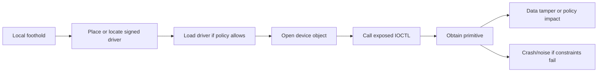

# BYOVD Modern Windows 11 Threat Model

Backlinks: [README](../../README.md) | [topic index](../research-index/topic-index.md) | [learning path](../research-index/windows-kernel-pwn-learning-path.md) | [mitigation matrix](../research-index/mitigation-version-matrix.md) | [mitigation deep dive](../mitigations/hvci-vbs-kdp-vtrp-hlat-deep-dive.md)

## Purpose

Provide a lab-safe, defensive model for Bring Your Own Vulnerable Driver research on modern Windows 11.

## What You Will Learn

- Why a valid driver signature is not equivalent to safe behavior.
- How driver loading requirements interact with Secure Boot, HVCI, WDAC, and blocklists.
- Which BYOVD primitives matter defensively.
- What telemetry appears before, during, and after driver abuse.

## Threat Model

BYOVD is the abuse of a signed kernel driver that exposes dangerous capability to a caller that should not have it. The vulnerable driver may be old, misconfigured, intentionally powerful, or newly discovered.

High-level chain:

## Driver Loading Requirements

| Requirement | Defensive meaning |
|---|---|
| Kernel-mode signing | Signature must validate, but behavior may still be unsafe. |
| Service Control Manager or `NtLoadDriver` path | Service key and image path are usually observable. |
| Admin or service-management rights | Many BYOVD chains require admin; some driver ACL bugs expose low-privileged IOCTL access after load. |
| Secure Boot | Enables stronger code integrity expectations; does not prove every signed driver is safe. |
| HVCI/Memory Integrity | Blocks classes of unsigned code execution and enforces CI, but may not block all vulnerable signed drivers. |
| Vulnerable driver blocklist | Blocks known-bad driver identities when enabled and current; hash/cert/version coverage matters. |
| WDAC/App Control | Can enforce enterprise allowlists beyond default blocklists. |

## BYOVD Primitive Taxonomy

| Primitive | Example source | Why dangerous | Defensive focus |
|---|---|---|---|
| Arbitrary kernel R/W | AsIO3, many BYOVD repos | Can alter process/object/security fields | Device ACL, IOCTL use, object tamper. |
| Physical memory R/W | eneio64, Lenovo | Can bridge to virtual memory through page walking | PhysicalMemory mapping, HVCI/KDP assumptions. |
| MSR write | WRMSR drivers | Can affect syscall path and CPU behavior | MSR IOCTLs, crash telemetry. |
| MMIO/port I/O | Hardware monitoring drivers | Can affect devices and low-level platform state | Driver inventory, hardware API exposure. |
| Process/security control | EDR killer class | Can terminate/protect/unprotect processes | Security service anomalies and kernel driver link. |
| DSE/CI tamper concept | g_CiOptions/CI callback sources | Attempts to load unsigned code | CI events, PatchGuard/secure-kernel crashes. |

## Secure Boot and Blocklist Effects

| Configuration | Expected risk |
|---|---|
| Secure Boot off | Larger legacy driver and unsigned/test-signed risk. |
| Secure Boot on, HVCI off | DSE stronger, but vulnerable signed drivers may still matter. |
| Secure Boot on, HVCI on | Stronger CI and blocklist posture; still verify policy and driver identity. |
| WDAC enforced | Best enterprise posture when allowlist is maintained. |
| Blocklist stale/off | Known-bad drivers may load even on otherwise modern systems. |

## EDR Visibility

Defenders should correlate:

- Driver file path, hash, signer, certificate chain, timestamp, and PE metadata.
- Service key creation/modification under `HKLM\SYSTEM\CurrentControlSet\Services`.
- Code Integrity block/audit events.
- Device object names and permissive security descriptors.
- User-mode process opening the device and issuing repeated IOCTLs.
- Follow-on anomalies: PPL/protection field changes, token changes, callback changes, security service failure, crash/reboot.

## High-Level Hunting Ideas

These are concepts, not evasion guidance:

| Hunt | Intent |
|---|---|
| Rare signed driver loaded from user-writable or temp-like paths | Find unusual driver staging. |
| New kernel service followed by immediate start/stop/delete | Find short-lived BYOVD patterns. |
| Driver signer not common in the enterprise baseline | Prioritize unknown hardware vendors. |
| Code Integrity blocked driver event | Confirm blocklist/WDAC is active and catching attempts. |
| Security tool service failure near driver load | Correlate possible kernel-level tamper. |
| Device object callable by low-integrity/user processes | Find dangerous ACL design. |

## Common Misconceptions

- “Signed” means authentic, not safe.
- The vulnerable driver blocklist is not a complete vulnerability scanner.
- HVCI on does not remove the need for driver inventory.
- Hash-only detection is fragile; certificate, version, path, and behavior matter.
- Public PoCs often hardcode offsets that are not portable.

## Questions to Ask Yourself

1. What policy allowed this driver to load?
2. Which process opened the device object?
3. Did the device object ACL match the intended trust boundary?
4. What primitive does the driver expose?
5. What version/mitigation setting changes the risk?

## Related Repo Docs

- [BYOVD detection playbook](../detection-and-mitigation/byovd-detection-engineering-playbook.md)
- [Mitigation and version matrix](../research-index/mitigation-version-matrix.md)
- [HVCI/VBS deep dive](../mitigations/hvci-vbs-kdp-vtrp-hlat-deep-dive.md)
- [Primitive reasoning framework](../kernel-research/primitive-reasoning-framework.md)
- [Case-study matrix](../research-index/case-study-matrix.md)

## References

- Quarkslab Lenovo CVE-2025-8061: https://blog.quarkslab.com/exploiting-lenovo-driver-cve-2025-8061_part2.html
- xacone eneio64: https://xacone.github.io/eneio-driver.html
- BlackSnufkin BYOVD: https://github.com/BlackSnufkin/BYOVD
- GhostWolfLab BYOVD paradigm: https://blog.ghostwolflab.com/apt/737/
- Microsoft vulnerable driver blocklist docs should be checked directly during operational use.
