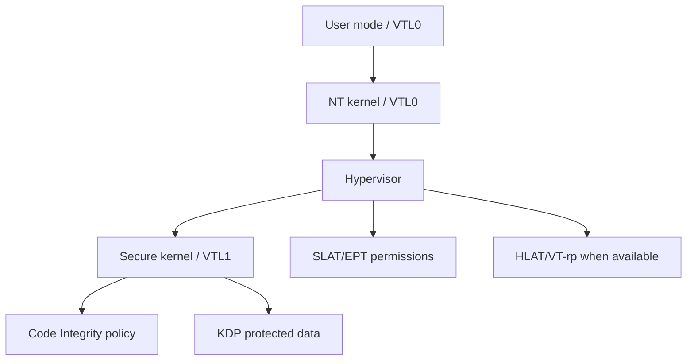

# HVCI, VBS, KDP, VT-rp, and HLAT Deep Dive

Backlinks: [README](../../README.md) | [topic index](../research-index/topic-index.md) | [learning path](../research-index/windows-kernel-pwn-learning-path.md) | [primitive framework](../kernel-research/primitive-reasoning-framework.md)

## Purpose

Explain how modern Windows changes kernel exploitation reasoning. This page is conceptual and defensive; it does not provide bypass recipes.

## What You Will Learn

- What VBS and HVCI move into a higher trust boundary.
- Why writable/executable kernel memory assumptions break.
- How KDP, VT-rp, and HLAT relate to data and translation protection.
- Why existing-code invocation and data-only attacks appear in modern write-ups.
- How to ask version-aware and detection-aware questions.

## Core Concepts

| Mitigation | Short definition | Research consequence |
|---|---|---|
| VBS | Virtualization-Based Security uses a secure world/VTL1 to protect sensitive decisions. | Normal kernel writes may not control the true policy boundary. |
| HVCI | Hypervisor-Enforced Code Integrity validates kernel code integrity. | Unsigned kernel code execution and simple PTE execute tricks fail. |
| KDP | Kernel Data Protection uses hypervisor backing for selected data. | Some target data cannot be modified from VTL0 even with strong writes. |
| KCFG/XFG | Indirect-call control-flow validation. | ROP/function-pointer abuse becomes constrained. |
| CET/kCET shadow stack | Hardware-backed return-address integrity. | Return-oriented chains become less viable. |
| VT-rp | Intel Virtualization Technology Redirect Protection. | Adds hardware support against paging remapping attacks. |
| HLAT | Hypervisor-managed linear address translation. | Protected linear addresses can ignore tampered guest page tables. |

## Architecture Mental Model

## What HVCI Blocks vs Does Not Block

| Action | HVCI effect |
|---|---|
| Loading unsigned kernel code | Blocks or causes secure-kernel failure depending on path. |
| Marking attacker data executable through PTE flags | Not sufficient; code integrity is enforced outside normal kernel assumptions. |
| Reusing already signed/existing kernel code | Not categorically blocked; KCFG/CET/PatchGuard may constrain it. |
| Data-only object modification | Not categorically blocked unless target is KDP-protected or consistency checks catch it. |
| Vulnerable signed driver load | Depends on signing, blocklist, Secure Boot, WDAC, HVCI policy, and driver identity. |

## Existing-Code Invocation Concept

Modern HVCI-era research often shifts from “run new unsigned code” to “cause existing trusted code to perform a sensitive operation.” This is why sources discuss ROP, syscall table concepts, callback routing, or signed-driver code reuse. The defensive lesson is that code integrity alone is not a complete behavioral policy; it must be paired with driver allowlisting, callback integrity monitoring, exploit mitigations, and telemetry.

## Version-Aware Matrix

| Environment | Expected effect |
|---|---|
| Windows 7 | VBS/HVCI absent; historical shellcode and registry/stack assumptions may hold only here. |
| Windows 10 with HVCI off | SMEP, KASLR, PatchGuard, KCFG/CET state vary by build; PTE attacks still face modern hardening. |
| Windows 10/11 with VBS on, HVCI off | Some CI data may be isolated; XPN shows why VBS without HVCI has different exposure than full HVCI. |
| Windows 11 22H2 HVCI on | Public research often targets data-only/existing-code concepts; validate CPU/build. |
| Windows 11 23H2/24H2+ | Kernel leaks and PreviousMode paths are more constrained; blocklist and Secure Boot posture matter. |
| 12th+ gen Intel with VT-rp available | HLAT can conceptually break remapping attacks if hypervisor uses it; availability is not the same as deployment. |

## Detection Notes

| Signal | Defensive question |
|---|---|
| Code Integrity events | Was a driver blocked, audited, or loaded under an unexpected policy? |
| Vulnerable driver blocklist event | Is Secure Boot/HVCI/WDAC actually enforcing blocklist? |
| New kernel callback registration | Which driver registered it and was that expected? |
| System crash with secure-kernel bugcheck | Did a kernel write collide with VBS/HVCI enforcement? |
| Symbol/PDB download from unusual process | Is software attempting dynamic offset discovery? |
| Driver load then rapid unload/delete | Is a BYOVD chain trying to minimize artifacts? |

## Common Misconceptions

- HVCI does not mean “kernel compromise is impossible”; it changes which primitives still matter.
- VBS and HVCI are related but not identical.
- VT-rp support in CPU specs does not prove Windows is using HLAT for a target.
- KDP protects selected data, not every kernel field.
- PatchGuard is delayed and probabilistic from the researcher perspective; “no instant crash” is not proof of safety.

## Questions to Ask Yourself

1. Is the claimed technique trying to execute new code, reuse existing code, or modify data?
2. Which trust boundary enforces the relevant decision: VTL0 kernel, hypervisor, or VTL1 secure kernel?
3. Is the target data protected by KDP or only by conventional page permissions?
4. Does KCFG/CET constrain the call path?
5. What telemetry appears if the technique fails?

## Related Repo Docs

- [Primitive reasoning framework](../kernel-research/primitive-reasoning-framework.md)
- [Page-table deep dive](../windows-internals/page-table-and-address-translation-deep-dive.md)
- [BYOVD threat model](../byovd/byovd-modern-windows-11-threat-model.md)
- [Case-study matrix](../research-index/case-study-matrix.md)

## References

- Connor McGarr, HVCI/KCFG: https://connormcgarr.github.io/hvci/
- XPN, g_CiOptions in a Virtualized World: https://blog.xpnsec.com/gcioptions-in-a-virtualized-world/
- Tandasat, Intel VT-rp and HLAT: https://tandasat.github.io/blog/2023/07/05/intel-vt-rp-part-1.html
- Datafarm, Code Execution against Windows HVCI: https://datafarm-cybersecurity.medium.com/code-execution-against-windows-hvci-f617570e9df0
- worawit/malk: https://github.com/worawit/malk
- Synacktiv, Windows kernel shadow stack mitigation: https://www.synacktiv.com/sites/default/files/2025-06/sstic_windows_kernel_shadow_stack_mitigation.pdf
- NCC Group mitigation timeline: https://github.com/nccgroup/exploit_mitigations/blob/main/windows_mitigations.md
- big5-sec component filter: https://big5-sec.github.io/posts/component-filter-mitigation/
