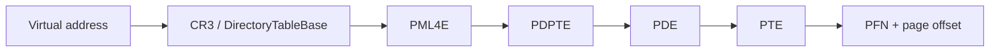

# Page Table and Address Translation Deep Dive

Backlinks: [README](../../README.md) | [topic index](../research-index/topic-index.md) | [learning path](../research-index/windows-kernel-pwn-learning-path.md)

## Purpose

Teach the mental model behind virtual address translation, physical read/write primitives, and why page-table reasoning remains central in modern Windows kernel research.

## What You Will Learn

- How CR3, PML4, PDPT, PD, PT, and PTEs cooperate.
- Why PFN plus page offset gives a physical address.
- Why physical memory R/W is powerful but not automatically equivalent to virtual kernel R/W.
- How KASLR, KVA shadow, VBS, HVCI, KDP, VT-rp, and HLAT affect page-table assumptions.
- What defenders can observe when a driver exposes physical memory or suspicious mappings.

## Prerequisites

You should know Windows x64 basics, paging vocabulary, and the difference between user mode, kernel mode, VTL0, and VTL1. Read [primitive reasoning](../kernel-research/primitive-reasoning-framework.md) before using this page with case studies.

## Core Concepts

| Term | Meaning | Why it matters |
|---|---|---|
| CR3 | CPU register pointing to the active top-level paging structure. | Context switch and process address-space identity. |
| PML4E | Top-level entry in 4-level x64 paging. | Selects a 512 GB region. |
| PDPTE | Page directory pointer table entry. | Can point to a PD or large 1 GB page. |
| PDE | Page directory entry. | Can point to a PT or large 2 MB page. |
| PTE | Page table entry. | Holds PFN and flags for a 4 KB page. |
| PFN | Page frame number. | Physical page identity. |
| Page offset | Low 12 bits for 4 KB pages. | Added to PFN base to form final physical address. |
| KVA shadow | Kernel Virtual Address Shadow/KPTI-like split. | Changes what is visible before/after syscall transition. |

## Deep Dive

An x64 virtual address is split into indexes and an offset:

```text
VA bits: [PML4 index][PDPT index][PD index][PT index][page offset]
         47..39      38..30      29..21    20..12    11..0
```

Translation uses the currently loaded CR3. The CPU walks:



A 4 KB PTE contains a PFN and flags such as present, writable, user/supervisor, NX, accessed, dirty, and cache behavior. The physical address for a 4 KB mapping is:

```text
physical_address = (PTE.PFN << 12) | (virtual_address & 0xfff)
```

Large pages shorten the walk. A 2 MB PDE mapping uses a 21-bit offset; a 1 GB PDPTE mapping uses a 30-bit offset. A researcher must identify page size before assuming the final offset width.

## User VA vs Kernel VA

User virtual addresses are process-private and normally subject to user/supervisor checks. Kernel virtual addresses are shared or globally mapped depending on Windows version, KVA shadow state, and build. Kernel pointers leaked in one context may still require the right CR3 view and mitigation state to be useful.

KVA shadow means a process can have a user-mode page table view and a kernel-capable page table view. Syscall entry switches into a view that can execute kernel transition code. This matters for WRMSR/LSTAR research because a hijacked syscall path may execute before the full kernel mapping and stack are available.

## KASLR and Symbols

KASLR randomizes module bases. PDB symbols can identify structure fields and function offsets, but they do not automatically authorize memory writes or make a technique stable. Build number, SKU, hotpatch state, and mitigation configuration still matter.

Use symbol-derived facts as versioned facts:

| Fact | Scope |
|---|---|
| `nt!Symbol + RVA` | Specific binary/PDB identity. |
| Structure field offset | Specific build and sometimes configuration. |
| Concept such as `PTE.PFN` | Architecture-level, but implementation details vary. |

## Why Page Walking Matters in Physical R/W

A vulnerable driver may expose physical memory mapping via `\Device\PhysicalMemory`, `MmMapIoSpace`, or similar hardware access APIs. To modify a kernel object whose address is known as a virtual address, the researcher must translate that virtual address to a physical address or create a controlled view.

Lab-safe reasoning chain:

1. Identify the target as a virtual address, not a physical address.
2. Identify the relevant CR3/page-table context.
3. Walk paging structures to recover the PFN.
4. Combine PFN and offset.
5. Account for large pages, KVA shadow, and VBS/KDP constraints.
6. Treat any write as destructive unless proven otherwise.

## HVCI/VBS/KDP Effects

| Mitigation | Impact on page-table reasoning |
|---|---|
| HVCI | Blocks unsigned kernel code execution and enforces executable page integrity through hypervisor-backed mechanisms. PTE permission changes are not enough to create trusted executable kernel code. |
| VBS | Moves sensitive integrity decisions into VTL1, outside normal kernel control. |
| KDP | Protects selected kernel data with hypervisor-backed restrictions. |
| VT-rp / HLAT | Can prevent remapping attacks by using hypervisor-managed linear translation for protected ranges. |
| KCFG/CET | Restrict control-flow reuse even when data writes are available. |

## Detection Notes

Defenders should watch for:

| Signal | Why it matters |
|---|---|
| Unexpected driver load | Physical R/W often begins with a signed driver. |
| Device object with permissive SDDL | Low-privilege processes may reach powerful IOCTLs. |
| Repeated IOCTLs to hardware/monitoring drivers | May indicate primitive probing. |
| `\Device\PhysicalMemory` mapping behavior | Rare in normal endpoint workloads. |
| Kernel crashes after driver IOCTLs | Failed translation or invalid writes often bugcheck. |
| Code Integrity or blocklist events | Loading may be blocked or audited. |

## Common Misconceptions

- Physical R/W is not automatically stable arbitrary virtual R/W.
- A PTE flag change does not defeat HVCI.
- A kernel address leak from one build is not a universal offset.
- KVA shadow does not remove the need to understand syscall transition state.
- HLAT/VT-rp claims must be tied to CPU support and hypervisor use.

## Questions to Ask Yourself

1. Which CR3 is active for this virtual address?
2. Is this a 4 KB, 2 MB, or 1 GB mapping?
3. What flags constrain access, execution, and user/supervisor behavior?
4. Does VBS/HVCI make the intended end state impossible?
5. What telemetry would reveal the mapping or driver interaction?

## Related Repo Docs

- [Primitive reasoning framework](../kernel-research/primitive-reasoning-framework.md)
- [HVCI/VBS/KDP/VT-rp/HLAT deep dive](../mitigations/hvci-vbs-kdp-vtrp-hlat-deep-dive.md)
- [BYOVD Windows 11 threat model](../byovd/byovd-modern-windows-11-threat-model.md)
- [Case-study matrix](../research-index/case-study-matrix.md)

## References

- Idafchev, “Exploiting WRMSR in vulnerable drivers”: https://idafchev.github.io/blog/wrmsr/
- xacone, “Exploiting eneio64.sys through Physical Memory R/W”: https://xacone.github.io/eneio-driver.html
- Datafarm, “Code Execution against Windows HVCI”: https://datafarm-cybersecurity.medium.com/code-execution-against-windows-hvci-f617570e9df0
- Tandasat, “Intel VT-rp - Part 1”: https://tandasat.github.io/blog/2023/07/05/intel-vt-rp-part-1.html
- BusterCall repository: https://github.com/zer0condition/BusterCall
